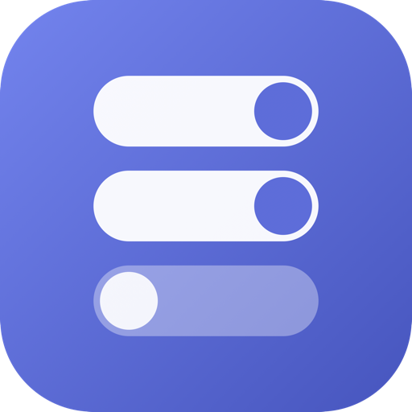
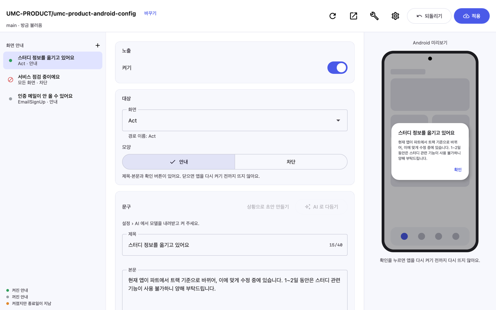
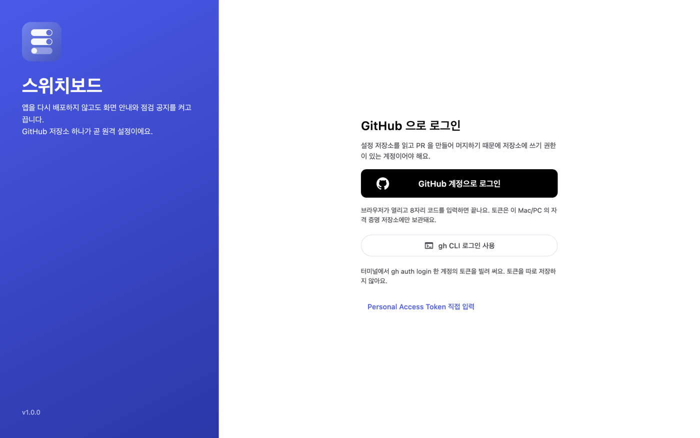
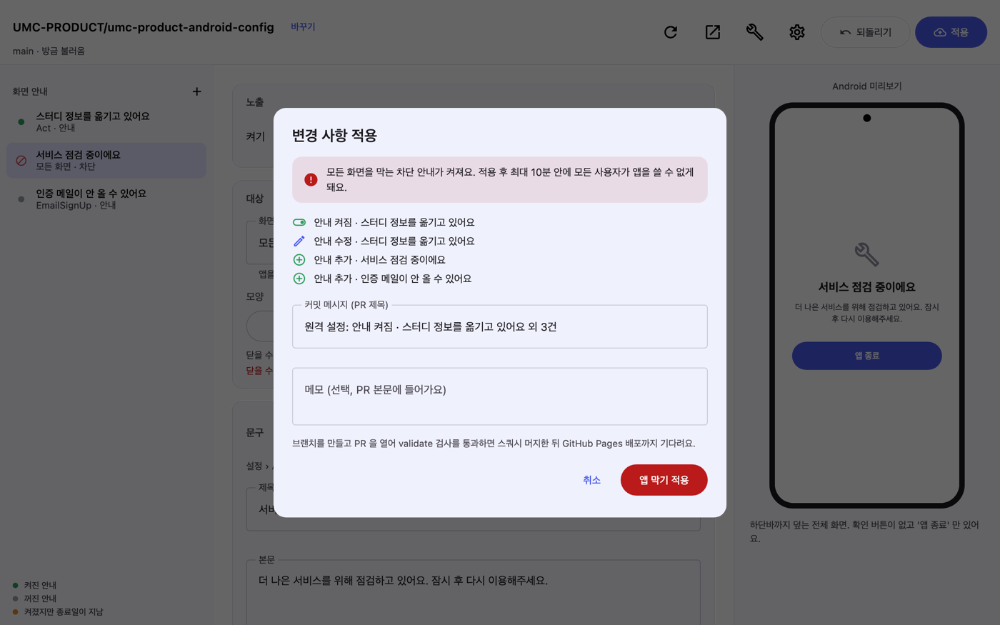

<div align="center">



# 스위치보드

<sub>Switchboard</sub>

**Android 원격 설정(remote config) 편집기 · macOS / Windows**

[**최신 버전 내려받기**](https://github.com/rudtjr1106/switchboard/releases/latest) · macOS: `Switchboard.dmg` · Windows: `Switchboard.msi`

</div>

앱을 새로 배포하지 않고도 특정 화면에 안내 다이얼로그를 켜고 끄고, 점검 공지를 띄우고, 강제 업데이트 기준을 올립니다.
설정은 GitHub 저장소의 `app-config.json` 하나이고, 앱은 GitHub Pages 로 서빙되는 그 파일을 읽습니다. 스위치보드는 그 저장소를 **폼으로 편집하고, PR → 검사 → 머지 → 배포**까지 대신 진행하는 데스크톱 앱입니다.

[UMC-PRODUCT/umc-product-iOS-remote-config](https://github.com/UMC-PRODUCT/umc-product-iOS-remote-config) 의 macOS 편집 앱(UMC Launchpad)에서 착안했고, [umc-product-android-config](https://github.com/UMC-PRODUCT/umc-product-android-config) 와 같은 저장소 형식을 씁니다.



| 로그인 | 적용 확인 (모든 화면 차단 경고) |
|---|---|
|  |  |

## 할 수 있는 것

| | |
|---|---|
| **GitHub 로그인 한 번으로 시작** | OAuth Device Flow(브라우저에서 8자리 코드 입력)로 로그인하면 끝. `gh` CLI 토큰이나 PAT 도 됩니다 |
| **저장소 자동 세팅** | "새 저장소 만들기" 를 누르면 `app-config.json` · `schema.json` · validate 워크플로 · README · GitHub Pages · main 보호 규칙까지 한 번에 만듭니다 |
| **폼 편집 + Android 미리보기** | 화면·모양·문구·종료일을 폼으로 고치고 오른쪽 폰 미리보기로 확인. 글자 수 초과, 잘못된 날짜, 스키마에 없는 화면은 입력 즉시 표시됩니다 |
| **안전한 적용** | 충돌 확인 → 브랜치 → 커밋 → PR → `validate` 검사 → 스쿼시 머지 → Pages 배포 확인. 머지 전에 실패하면 PR 과 브랜치를 정리합니다. 모든 화면을 막는 차단 안내는 빨간 경고와 함께 별도 버튼으로만 켜집니다 |
| **스키마 기반** | 화면 목록·글자 수 제한·`minimumVersion` 지원 여부를 저장소의 `schema.json` 에서 읽습니다. 저장소마다 규칙이 달라도 앱을 고칠 필요가 없습니다 |
| **Android 프로젝트 세팅** | 로컬 Android 프로젝트를 AI 없이 스캔해 내비게이션 목적지(타입 세이프·Navigation 3·문자열 route·XML 그래프), DI(Hilt·Koin·Dagger), HTTP(Retrofit·Ktor)를 알아냅니다. `build-logic` 컨벤션 플러그인도 따라갑니다. 그 프로젝트에 맞는 연동 코드를 만들고, 알아보지 못한 부분은 온디바이스 AI 가 프로젝트의 실제 코드를 보고 고쳐 씁니다. 화면 목록은 저장소 `schema.json` 에 PR 로 반영합니다 |
| **온디바이스 AI** | llama.cpp + Gemma 3 를 이 컴퓨터에서 돌립니다. 안내 문구 다듬기·상황 설명으로 초안 만들기, 화면 이름에 한국어 라벨·구분 붙이기. 문구가 밖으로 나가지 않습니다 |

## 설치

1. [Releases](https://github.com/rudtjr1106/switchboard/releases/latest) 에서 `Switchboard.dmg`(macOS) 또는 `Switchboard.msi`(Windows)를 받습니다. 설치하면 앱 이름은 **스위치보드**로 보입니다
2. macOS: 열린 창에서 앱을 `Applications` 로 끌어다 놓습니다. Windows: MSI 를 실행합니다
3. 처음 켜면 GitHub 로그인 화면이 나옵니다

앱은 켜질 때 새 릴리즈가 있는지 확인하고 위쪽에 알림 띠를 띄웁니다. JVM 이 함께 들어 있어 따로 설치할 것은 없습니다.

### GitHub 로그인 방식

| 방식 | 필요한 것 |
|---|---|
| 브라우저 로그인 (추천) | 없음. **GitHub 으로 로그인** 을 누르고 브라우저에 8자리 코드를 넣으면 끝납니다 |
| gh CLI | `brew install gh` + `gh auth login`. 앱이 `gh auth token` 으로 토큰을 빌려 씁니다 |
| Personal Access Token | `repo` · `workflow` · `read:org` 스코프 |

브라우저 로그인은 GitHub OAuth App 으로 진행됩니다. Client ID 는 `gradle.properties` 의 `switchboard.githubClientId` 에 들어 있고 비밀값이 아닙니다.

- 조직이 서드파티 OAuth 앱 접근을 제한하면, 처음 로그인할 때 승인 화면의 조직 옆 **Request** 를 눌러 관리자 승인을 받아야 그 조직 저장소를 쓸 수 있습니다
- 포크해서 자기 이름으로 배포하려면 OAuth App 을 새로 등록하고(Enable Device Flow 체크, Expire user access tokens 해제) `gradle.properties` 의 Client ID 를 바꾸세요

## 저장소 형식

스위치보드가 만드는(그리고 읽는) 설정 저장소는 아래 네 파일로 이뤄집니다.

| 파일 | 설명 |
|---|---|
| `app-config.json` | 실제 설정. 앱이 `https://<owner>.github.io/<repo>/app-config.json` 에서 읽습니다 (캐시 10분) |
| `schema.json` | 값의 규칙. `screen` enum, `template` enum, 글자 수 제한, `minimumVersion` 패턴. 편집기가 이 파일을 읽어 폼을 만듭니다. `x-switchboard.screens` 에 화면의 한국어 이름과 구분을 둡니다 |
| `.github/workflows/validate.yml` | PR 마다 `jsonschema` 로 검사. job 이름 `validate` 를 앱이 기다립니다 |
| `README.md` | 운영진용 안내 |

```json
{
  "$schema": "./schema.json",
  "version": 1,
  "minimumVersion": "",
  "notices": [
    {
      "screen": "ALL",
      "enabled": false,
      "template": "BLOCKING",
      "title": "서비스 점검 중이에요",
      "body": "더 나은 서비스를 위해 점검하고 있어요. 잠시 후 다시 이용해주세요.",
      "until": "2026-09-20"
    }
  ]
}
```

이 앱으로 만들지 않은 저장소도 `app-config.json` 과 `schema.json` 이 있으면 "주소로 열기" 로 열립니다.

## 개발

Kotlin 2.4 · Compose Multiplatform 1.12 (Desktop) · Gradle 9. JDK 는 툴체인이 자동으로 받습니다.

```sh
./gradlew :app:run            # 실행
./gradlew test                # 전체 테스트
./gradlew :app:packageMacDmg  # macOS 설치 파일 (macOS 에서만, 앱 이름 스위치보드.app)
./gradlew :app:packageMsi     # Windows 설치 파일 (Windows 에서만)
```

| 모듈 | 역할 |
|---|---|
| `core/config` | `schema.json` 해석, `app-config.json` 읽기/쓰기(원본 서식 유지), 검사, 변경 요약, 저장소 템플릿 |
| `core/github` | GitHub REST 클라이언트, Device Flow, 토큰 보관(키체인/자격 증명 관리자), 적용 파이프라인, 저장소 부트스트랩 |
| `core/ai` | java-llama.cpp 엔진, 모델 내려받기, 문구·라벨·코드 적응 서비스 |
| `core/scanner` | Android 프로젝트 스캔(Gradle 파일·내비게이션 목적지), 연동 코드 템플릿 |
| `app` | Compose Desktop UI, 세션·워크스페이스·편집기 상태 |

### 온디바이스 AI 하네스

작은 로컬 모델(Gemma 3 1B·4B)이 틀리기 쉬운 부분을 코드로 먼저 잡고, 모델은 다듬기만 하게 합니다.

| 단계 | 화면 라벨 | 안내 문구 |
|---|---|---|
| 결정적 초안 | 목적지 주석(`//공지 상세`), 구역 제목(`/**공지 섹션**/`, `// region`), 용어 사전으로 라벨·구분 초안 (`ScreenDrafts`) | 실제 UMC 안내를 예시로 넣은 말투 규칙 |
| 모델 | 초안이 약한 화면만 보내고, 믿지 못할 주석은 빼고 보여줌 | JSON 스키마로 `{title, body}` 강제 |
| 검증 | 한글·길이·말 빠짐·화살표 검사. 통과 못 하면 초안 유지. 구역이 있으면 구분은 구역을 따름 | 합쇼체→해요체 변환(`KoreanTone`), 인사말 제거, 날짜·숫자 누락·글자 수 검사 후 한 번 다시 쓰기 (`NoticeChecks`) |

정답 세트는 `core/ai/src/test/resources/harness/` 에 있습니다. UMC-PRODUCT/umc-product-android 의 화면 34개(주석·구역은 소스 그대로, 이름·구분은 원격 설정 README 표)와 안내 문구 11건입니다.

```sh
./gradlew :core:ai:test     # 결정적 초안 기준선 (라벨 70%·구분 95% 아래로 떨어지면 실패)
./gradlew :core:ai:aiEval   # 받아 둔 모델로 평가, build/reports/ai-eval/ 에 보고서
```

Gemma 3 1B 로 잰 결과 (M1 16GB):

| | 라벨 정확 | 구분 정확 | 안내 문구 검사 통과 |
|---|---|---|---|
| 모델만 (id 만 넘김) | 41~44% | 74% | 1/11 (하네스 전) |
| 하네스 | 71% | 100% | 11/11 |

4B 모델을 받아 두면 `aiEval` 이 자동으로 4B 로 평가합니다.

### 앱 이름

보이는 이름은 **스위치보드**, 저장소·패키지·데이터 폴더(`~/Library/Application Support/Switchboard`)는 영문 `Switchboard` 입니다.

- macOS `codesign` 은 실행 파일 이름이 한글이면 서명하지 못합니다. 그래서 실행 파일은 `Switchboard` 로 두고, `packageMacDmg` 가 서명된 번들을 `스위치보드.app` 폴더 이름으로 담습니다. 폴더 이름은 서명에 들어가지 않아 서명이 유지됩니다
- 메뉴 막대·Dock 이름은 `dockName`(`-Xdock:name`), Windows 시작 메뉴·설치 폴더는 `packageName` 으로 정합니다

### 브랜드 이미지

`build-tools/draw-icon.swift` 가 정확한 픽셀 크기로 그립니다. GitHub 는 1MB 이하만 받습니다.

| 파일 | 용도 |
|---|---|
| `docs/brand/switchboard-logo-512.png` | GitHub OAuth App 로고, 프로필·아바타 |
| `docs/brand/switchboard-logo-1024.png` | 고해상도 원본 |
| `docs/brand/switchboard-social-1280x640.png` | 저장소 Settings › Social preview |

### 화면 스크린샷

`app/src/test/.../ui/ScreenshotTest.kt` 가 주요 화면을 헤드리스로 그려 `app/build/screenshots/` 에 PNG 로 남깁니다. README 의 이미지는 여기서 나온 것입니다.

```sh
./gradlew :app:test --tests '*ScreenshotTest*'
```

### 릴리즈

1. `gradle.properties` 의 `switchboard.version` 을 올려 `main` 에 머지합니다
2. 같은 버전으로 태그를 푸시합니다: `git tag v1.2.0 && git push origin v1.2.0`
3. `release.yml` 이 macOS 와 Windows 러너에서 설치 파일을 만들어 릴리즈에 `Switchboard.dmg` · `Switchboard.msi` 로 붙입니다

> macOS 설치 파일은 서명·공증되지 않은 상태입니다. Developer ID 인증서가 있으면 `app/build.gradle.kts` 의 `macOS { signing { } notarization { } }` 을 채우세요.

## 알려진 제약

- macOS 설치 파일은 서명·공증 전이라 처음 열 때 Gatekeeper 확인이 필요합니다
- Windows 빌드는 GitHub Actions 의 `windows-latest` 러너에서 만듭니다. 이 저장소는 macOS 에서 개발됐고 Windows 실행은 CI 로만 검증합니다
- java-llama.cpp 4.2.0 은 모델을 내려도 메모리를 완전히 돌려주지 않습니다 (4B → 1B 전환 시 이전 모델이 상주). 모델을 바꾸면 앱을 다시 켜는 편이 안전합니다
- 번들된 llama.cpp(b4916)가 아는 아키텍처만 씁니다. Gemma 3 는 되고 Qwen3 는 로드되지 않습니다
- 개발 중 `SWITCHBOARD_GH_AUTOLOGIN=1` 환경 변수로 실행하면 저장된 토큰이 없어도 `gh auth token` 으로 바로 로그인합니다

## 쓰인 자료

- GitHub 로그인 버튼의 마크: [Primer Octicons](https://github.com/primer/octicons) `mark-github-24` (MIT License, © GitHub Inc.). [GitHub 로고 사용 규칙](https://github.com/logos)에 따라 모양을 바꾸지 않고 단색으로 씁니다

## 라이선스

[MIT](LICENSE)
