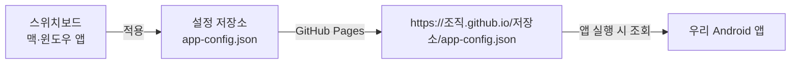
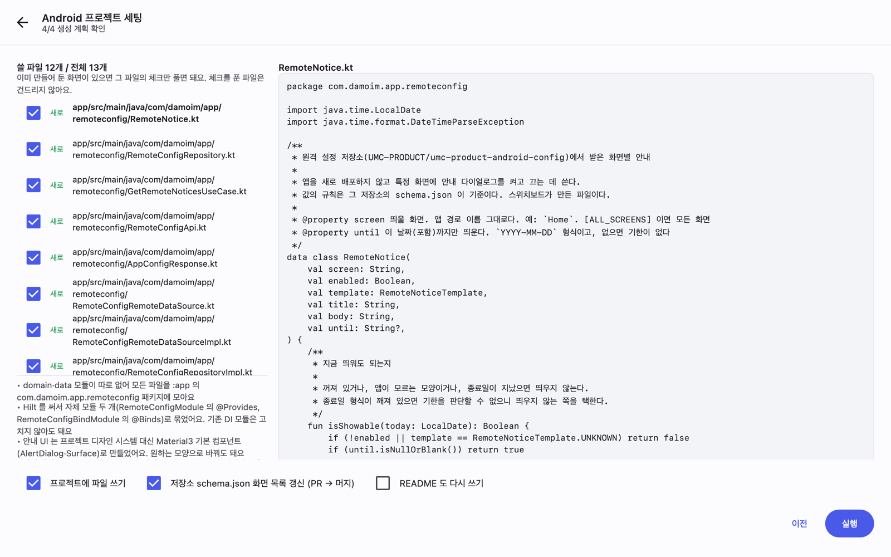

# 스위치보드 사용법 (Android 팀)

앱을 새로 배포하지 않고 점검 공지와 강제 업데이트를 켜고 끄는 도구다. 스토어 심사를 거치지 않으므로 반영까지 몇 분이면 된다.

---

## 0. 동작 구조

설정 값은 GitHub 저장소 하나에 `app-config.json` 으로 보관한다. GitHub Pages 가 이 파일을 정적 주소로 제공하고, 앱은 실행할 때 그 주소를 읽는다.



- 평소 운영에서 다루는 대상은 설정 저장소 하나다. Android 프로젝트 코드는 최초 1회만 연결하면 된다.
- 안내는 화면(Route) 단위로 지정한다. `Home`, `MeetingDetail` 같은 경로 이름이 그대로 식별자가 된다.

---

## 1. 설치

| OS | 배포 파일 | 설치 방법 |
| --- | --- | --- |
| macOS | `Switchboard.dmg` | 열어서 `스위치보드.app` 을 `Applications` 로 이동 |
| Windows | `Switchboard-windows.zip` | 임의 폴더에 압축 해제 후 `Switchboard.exe` 실행 (설치 절차 없음) |

[최신 버전 내려받기](https://github.com/rudtjr1106/switchboard/releases/latest)

- macOS 빌드는 Apple 공증을 받았으므로 경고 없이 실행된다. Windows 빌드는 서명이 없어 SmartScreen 경고가 한 번 표시된다(`추가 정보` → `실행`).
- 새 버전이 나오면 앱 상단에 알림 띠가 뜬다. **지금 업데이트** 를 누르면 내려받기·교체·재실행까지 자동으로 처리한다. 수동 재설치는 필요 없다.

---

## 2. GitHub 로그인


**GitHub 계정으로 로그인** 을 누르면 브라우저에 코드 입력 화면이 열린다. 앱에 표시된 8자리 코드를 입력하면 인증이 끝난다.

- 설정 저장소가 조직(예: UMC-PRODUCT) 소유라면 로그인 시 해당 조직 접근까지 허용해야 목록에 나타난다.
- 값을 수정하려면 저장소 쓰기(push) 권한이 필요하다. 권한이 없으면 읽기 전용으로 열린다.

---

## 3. 설정 저장소 선택


로그인하면 본인 계정과 소속 조직의 저장소가 표시된다. 팀에서 쓰는 설정 저장소를 선택한다.

저장소가 아직 없으면 **새로 만들기** 로 생성한다. 저장소, `app-config.json`, `schema.json`, 검사 워크플로, GitHub Pages 설정까지 한 번에 준비된다.


**소유자** 에서는 본인 계정뿐 아니라 조직(organization)도 선택할 수 있다. 팀 저장소는 조직 소유로 만드는 편이 일반적이다.

- 조직이 목록에 없다면 해당 조직이 이 앱의 접근을 승인하지 않은 상태다. 다이얼로그의 **승인 설정 열기** 에서 접근을 허용하거나 관리자에게 승인을 요청한다.
- 조직에 저장소를 만들 권한이 없으면 확인할 항목(앱 승인 여부, 조직의 `Settings › Member privileges`)을 오류 메시지로 안내한다. 승인 절차가 어려우면 관리자가 저장소를 만든 뒤 앱에서 열어 사용해도 된다.

> 설정 저장소는 공개로 만든다. GitHub Pages 가 공개 저장소에서만 무료이기 때문이다. 따라서 키·토큰 같은 비밀값은 저장하지 않는다.

---

## 4. 공지 관리


왼쪽은 안내 목록, 가운데는 값 편집 영역, 오른쪽은 Android 미리보기다. 미리보기는 실제 앱에 표시되는 형태와 같다.

**노출** — 해당 안내의 표시 여부다. 이 값만 바꿔도 반영된다.

**대상**

| 항목 | 설명 |
| --- | --- |
| 화면 | 안내를 표시할 화면. `모든 화면(ALL)` 을 선택하면 전 화면에 표시된다 |
| 모양 · 안내 | 제목·본문과 확인 버튼이 있는 다이얼로그. 닫으면 앱을 다시 실행하기 전까지 표시되지 않는다 |
| 모양 · 차단 | 화면 전체를 덮어 조작을 막는다. 점검 상황에 사용한다 |


**문구**

| 항목 | 제한 |
| --- | --- |
| 제목 | 40자 |
| 본문 | 200자 |
| 종료일 | `YYYY-MM-DD` 형식. 해당 일자까지 표시하며 비우면 기한이 없다 |

목록 왼쪽의 점 색상이 상태를 나타낸다. 초록은 켜짐, 회색은 꺼짐, 주황은 켜져 있으나 종료일이 지난 상태다.

---

## 5. 강제 업데이트


`최소 버전` 보다 낮은 버전의 앱은 업데이트 화면에서 차단된다.

- 값을 비우면 강제 업데이트를 적용하지 않는다.
- `2.3` 또는 `2.3.0` 처럼 숫자와 점만 입력한다. `v2.3.0` 같은 표기는 검사 단계에서 거부된다.
- 패치 자리까지 비교한다. `2.3.0` 으로 지정하면 `2.2.9` 는 차단되고 `2.3.0` 은 통과한다.

---

## 6. 적용

오른쪽 위 **적용** 을 누르면 다음 순서로 진행된다.


```
충돌 확인 → 브랜치 만들기 → 커밋 → PR 열기 → 검사(validate) → 머지 → 배포(GitHub Pages)
```

- 값의 유효성은 PR 검사에서 한 번 더 확인한다. 검사에 실패하면 머지되지 않는다.
- 모든 변경이 PR 이력으로 남아 변경 주체와 시점을 추적할 수 있다.
- 배포까지 보통 1~3분이 걸린다. 이후 앱을 다시 실행하면 반영된다.
- 다른 사람이 먼저 수정했다면 충돌 확인 단계에서 중단된다. 새로고침 후 다시 적용한다.

---

## 7. Android 프로젝트 연결 (최초 1회)

편집기 오른쪽 위 공구 아이콘에서 **Android 프로젝트 세팅** 을 연다. 전체 4단계다.

### 1단계 · 프로젝트 선택


Android 프로젝트 루트 폴더(`settings.gradle.kts` 가 있는 위치)를 선택한다.

### 2단계 · 화면 선택


DI·HTTP·내비게이션 구성과 화면(Route) 목록을 자동으로 분석한다. Hilt·Koin·Dagger, Retrofit(Gson·Moshi·kotlinx)·Ktor, Compose 타입세이프 내비게이션과 XML 내비게이션을 인식한다.

여기서 선택한 화면이 `schema.json` 의 화면 목록이 되고, 편집기의 **화면** 드롭다운에 그대로 반영된다.

### 3단계 · 화면 이름 지정


`MeetingDetail` 같은 경로 이름은 기획·디자인 담당자가 알아보기 어렵다. 한국어 이름과 구분을 함께 지정한다. 소스의 주석과 구역 제목에서 초안을 채우므로 검토만 하면 된다. 온디바이스 AI 를 켠 상태라면 **AI 로 다듬기** 로 일괄 정리할 수 있다.

### 4단계 · 계획 확인 및 실행


생성할 파일을 전부 미리 보여준 뒤 실행한다. 계층 모듈 여부와 DI 종류에 맞춰 코드를 생성한다.

### 기존 화면을 유지하는 경우

파일마다 체크를 해제할 수 있다. 체크를 해제한 파일은 생성 대상에서 빠지며 기존 파일을 수정하지 않는다.



- 팀 디자인으로 만든 안내 다이얼로그가 이미 있다면 `RemoteNoticeHost.kt` 만 해제하고 나머지를 받는다. 데이터·도메인·DI 코드만 추가되므로 기존 화면에서 `RemoteNoticeViewModel` 을 사용하면 된다.
- 같은 경로에 파일이 이미 있으면 처음부터 해제 상태(`있음` 표시)로 표시한다. 기존 파일을 임의로 덮어쓰지 않는다. 새로 받으려면 체크한 뒤 오른쪽에서 내용을 비교해 판단한다.
- 제외한 파일의 클래스를 남은 파일이 참조하면 경고를 표시한다. `RemoteNoticeViewModel` 을 제외했는데 `RemoteNoticeHost` 가 이를 참조하는 경우가 그렇다. 이미 프로젝트에 존재하는 파일을 유지하는 경우에는 경고하지 않는다.


### 생성되는 파일

다이얼로그와 차단 화면 UI 까지 함께 생성한다. 별도로 구현할 필요가 없다.

| 층 | 파일 |
| --- | --- |
| UI | `RemoteNoticeHost.kt` (안내 다이얼로그), `RemoteBlockingScreen.kt` (전체 차단 화면), `RemoteNoticeViewModel.kt` |
| domain | `RemoteNotice.kt`, `RemoteConfigRepository.kt`, `GetRemoteNoticesUseCase.kt` |
| data | `RemoteConfigApi.kt`, `AppConfigResponse.kt`, `RemoteConfigRemoteDataSource(+Impl).kt`, `RemoteConfigRepositoryImpl.kt` |
| DI | `RemoteConfigModule.kt`, `RemoteConfigBindModule.kt` |

- 안내 UI 는 Material3 기본 컴포넌트로 작성한다. 팀 디자인 시스템에 맞게 수정해도 된다. 수정 후 세팅을 다시 실행해도 해당 파일은 기본이 해제 상태이므로 덮어쓰지 않는다.
- 네트워크 코드는 프로젝트가 사용 중인 라이브러리에 맞춘다. Retrofit 이면 전용 OkHttp 인스턴스에 1MB 디스크 캐시와 10초 타임아웃을 설정한다.

### 직접 처리해야 하는 작업

완료 화면이 파일 경로가 포함된 코드 조각으로 안내한다. 보통 다음 네 가지다.

1. 메인 Activity 의 `setContent` 에서 `NavHost`(또는 `Scaffold`)를 `Box` 로 감싸고 마지막에 `RemoteNoticeHost(currentRoute = ...)` 를 배치한다. 차단 안내가 하단바까지 덮어야 하므로 `Scaffold` 바깥에 두어야 한다.
2. `AndroidManifest.xml` 에 `INTERNET` 권한을 추가한다(없는 경우).
3. DI 를 등록한다. Hilt 는 자동이며, Dagger 는 `@Component(modules = [...])` 에, Koin 은 `startKoin { modules(...) }` 에 추가한다.
4. 누락된 의존성을 추가한다(해당 시 목록으로 안내한다).

> Compose 를 쓰지 않는 프로젝트에서는 UI 를 생성하지 않고 ViewModel 을 관찰해 다이얼로그를 표시하는 방법을 안내한다.
> XML 내비게이션에서는 화면 이름이 목적지의 `android:id` 이름이므로, `resources.getResourceEntryName(destination.id)` 로 현재 화면 이름을 얻는 코드를 안내한다.

### 갱신 시점

`RemoteNoticeHost` 는 앱이 화면에 올라올 때마다(`ON_START`) 설정을 다시 읽는다. 사용자가 앱을 재실행하거나 다른 앱에서 복귀하면 새 공지가 표시된다.

---

## 8. 온디바이스 AI (선택)


`설정 › AI` 에서 모델을 내려받으면 쓸 수 있다. 모델은 로컬에서만 실행되며 외부로 전송되지 않는다.

- 공지 문구 다듬기, 상황 설명만으로 초안 생성
- 화면 이름 한국어 라벨링
- 스캐너가 인식하지 못한 프로젝트 구조에 맞춘 코드 수정

AI 를 켜지 않아도 위의 모든 기능은 똑같이 동작한다.

---

## 9. 문제 해결

| 증상 | 원인과 조치 |
| --- | --- |
| 저장소·조직이 목록에 없음 | 조직이 이 앱의 접근을 승인하지 않은 경우가 대부분이다. 저장소 만들기의 **승인 설정 열기** 에서 허용하거나, 로그아웃 후 다시 로그인하면서 조직 접근을 허용한다 |
| 값이 수정되지 않음 (읽기 전용) | 저장소 쓰기 권한이 없다. 저장소 관리자에게 권한을 요청한다 |
| 적용이 충돌 확인에서 중단됨 | 다른 사람이 먼저 수정했다. 새로고침 후 다시 적용한다 |
| 적용했으나 앱에 반영되지 않음 | Pages 배포에 1~3분이 걸린다. 이후 앱을 완전히 종료했다 실행한다 |
| 의도하지 않은 화면에 안내가 표시됨 | 편집기의 화면 이름과 앱의 Route 이름이 다르다. 세팅을 다시 실행해 화면 목록을 맞춘다 |
| 종료일이 지났는데 계속 표시됨 | 표시 여부는 기기 날짜를 기준으로 판단한다. 기기 날짜를 확인한다 |

---

문의 사항은 [이슈](https://github.com/rudtjr1106/switchboard/issues)로 남긴다.
