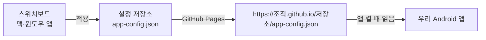
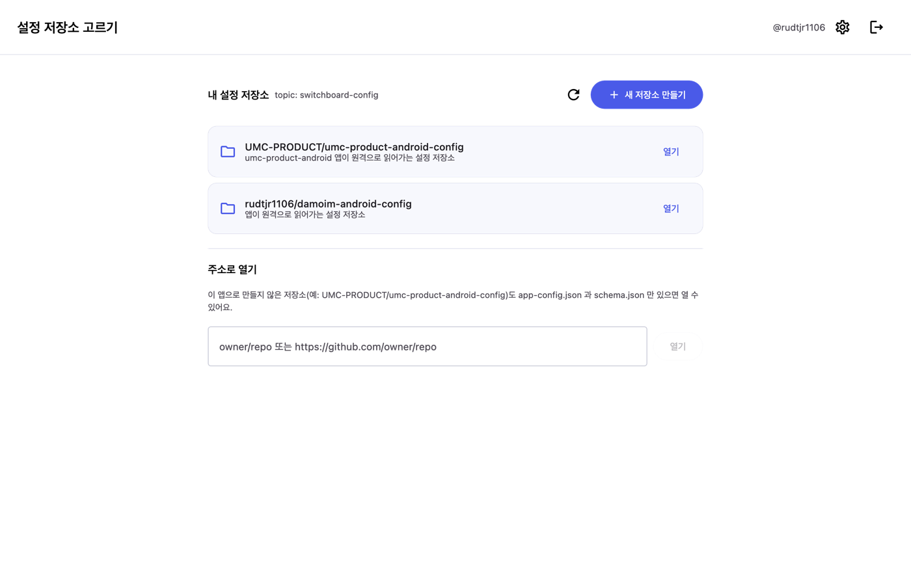
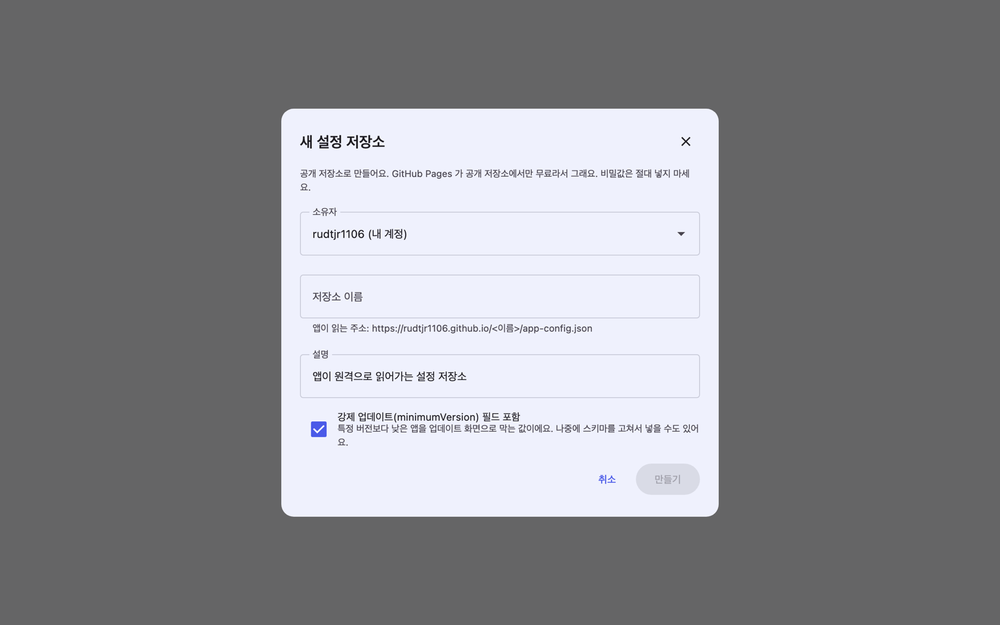
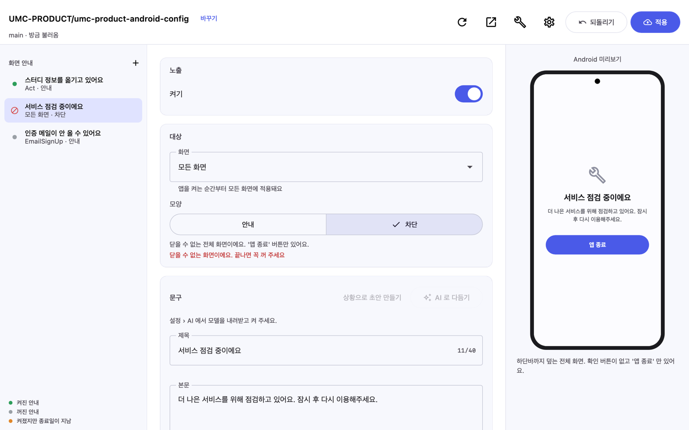
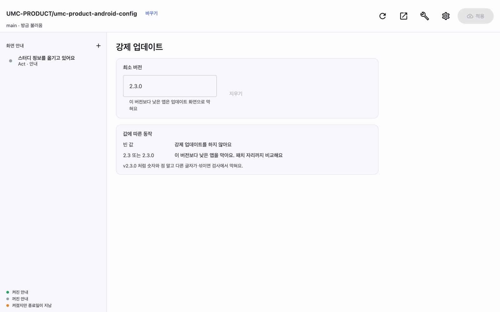
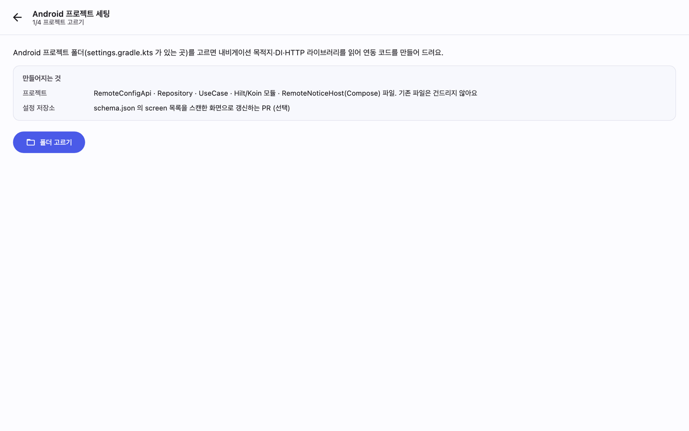
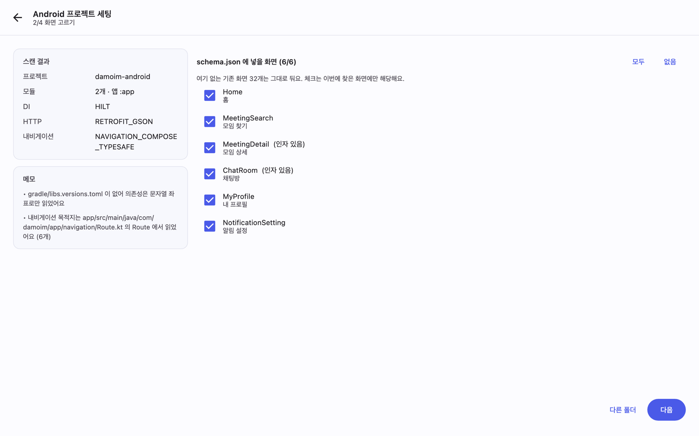
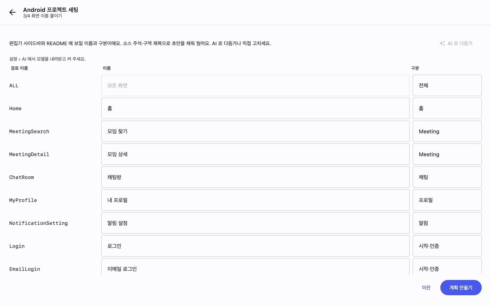
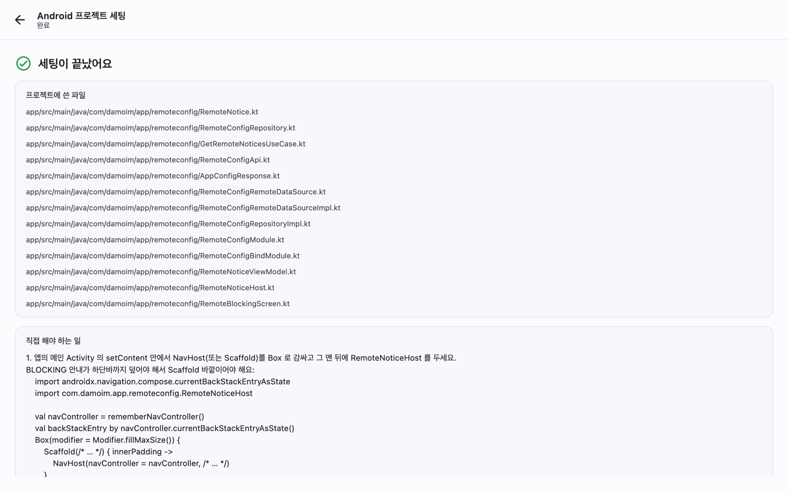
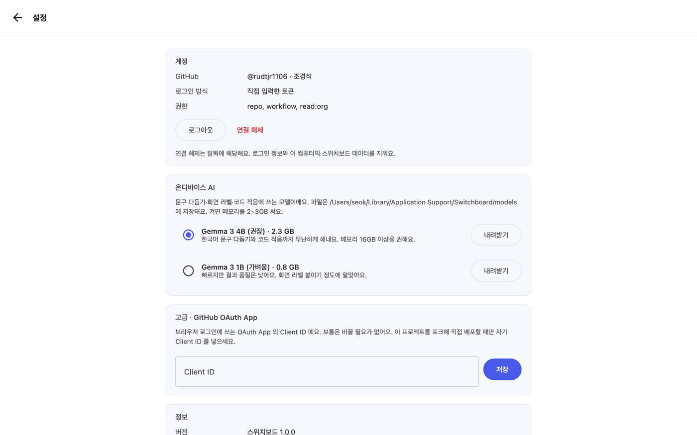

# 스위치보드 사용법 (Android 팀)

앱을 새로 배포하지 않고 **점검 공지**와 **강제 업데이트**를 켜고 끄는 도구예요. 스토어 심사 없이 몇 분이면 반영돼요.

---

## 0. 먼저 그림부터

설정 값은 GitHub 저장소 하나에 `app-config.json` 으로 들어 있고, GitHub Pages 가 그 파일을 웹에 올려 줘요. 앱은 켜질 때 그 주소를 읽어요.



- 우리가 만지는 건 **설정 저장소** 하나예요. Android 프로젝트 코드는 처음 한 번만 붙이면 그다음엔 손댈 일이 없어요
- 앱에는 **화면(Route) 이름** 단위로 안내를 띄워요. `Home`, `MeetingDetail` 처럼요

---

## 1. 설치

| OS | 받을 것 | 하는 법 |
| --- | --- | --- |
| macOS | `Switchboard.dmg` | 열고 `스위치보드.app` 을 `Applications` 로 끌어다 놓기 |
| Windows | `Switchboard-windows.zip` | 원하는 폴더에 풀고 `Switchboard.exe` 실행 (설치 과정 없음) |

[최신 버전 받기](https://github.com/rudtjr1106/switchboard/releases/latest)

- macOS 는 Apple 공증을 받아서 경고 없이 바로 열려요. Windows 는 서명이 없어서 SmartScreen 이 한 번 물어봐요 (`추가 정보` → `실행`)
- 새 버전이 나오면 앱 위쪽에 띠가 뜨고 **지금 업데이트** 를 누르면 알아서 받아서 바꿔 끼우고 다시 켜져요. 다시 받을 필요 없어요

---

## 2. GitHub 로그인


**GitHub 계정으로 로그인** 을 누르면 브라우저가 열리고 코드를 넣는 화면이 나와요. 앱에 뜬 8자리 코드를 넣으면 끝이에요.

- 설정 저장소가 **조직(예: UMC-PRODUCT)** 소속이면, 로그인할 때 그 조직 접근을 함께 허용해야 목록에 보여요
- 저장소에 **쓰기(push) 권한**이 있어야 값을 바꿀 수 있어요. 권한이 없으면 읽기 전용으로 열려요

---

## 3. 설정 저장소 고르기



로그인하면 내 계정과 조직의 저장소가 보여요. 팀에서 쓰는 설정 저장소를 열면 돼요.

아직 없다면 **새로 만들기** 로 한 번에 만들 수 있어요. 저장소 · `app-config.json` · `schema.json` · 검사 워크플로 · GitHub Pages 까지 알아서 준비해요.



> 설정 저장소는 **공개**로 만들어요. GitHub Pages 가 공개 저장소에서만 무료라서 그래요. 그러니 **비밀값(키·토큰)은 절대 넣지 마세요.**

---

## 4. 공지 켜고 끄기


왼쪽이 안내 목록, 가운데가 값, 오른쪽이 **Android 미리보기** 예요. 실제로 앱에서 보이는 모양 그대로 나와요.

**노출** — 이 안내를 지금 띄울지 말지예요. 껐다 켜는 것만으로 바로 반영돼요.

**대상**

| 항목 | 설명 |
| --- | --- |
| 화면 | 어느 화면에서 띄울지. `모든 화면(ALL)` 을 고르면 어디서나 떠요 |
| 모양 · 안내 | 제목·본문과 확인 버튼이 있는 다이얼로그. 닫으면 앱을 다시 켜기 전까지 안 떠요 |
| 모양 · 차단 | 화면 전체를 덮어 아무것도 못 하게 막아요. 점검 때 쓰는 값이에요 |



**문구**

| 항목 | 제한 |
| --- | --- |
| 제목 | 40자 |
| 본문 | 200자 |
| 종료일 | `YYYY-MM-DD`. 이 날(포함)까지만 떠요. 비우면 기한 없음 |

왼쪽 목록의 점 색으로 상태를 알 수 있어요 — 🟢 켜짐 / ⚪ 꺼짐 / 🟠 켜져 있지만 종료일이 지남.

---

## 5. 강제 업데이트



`최소 버전` 보다 낮은 앱은 업데이트 화면으로 막혀요.

- 비우면 강제 업데이트를 하지 않아요
- `2.3` 또는 `2.3.0` 처럼 숫자와 점만 써요 (`v2.3.0` 은 검사에서 막혀요)
- 패치 자리까지 비교해요. `2.3.0` 으로 두면 `2.2.9` 는 막히고 `2.3.0` 은 통과해요

---

## 6. 적용하기

오른쪽 위 **적용** 을 누르면 이 순서로 진행돼요.


```
충돌 확인 → 브랜치 만들기 → 커밋 → PR 열기 → 검사(validate) → 머지 → 배포(GitHub Pages)
```

- 값이 규칙에 맞는지는 **PR 검사**가 한 번 더 봐요. 여기서 걸리면 머지되지 않아요
- 히스토리가 PR 로 남아서 **누가 언제 무엇을 켰는지** 다 보여요
- 배포까지 보통 **1~3분** 걸려요. 그 뒤에 앱을 다시 켜면(또는 백그라운드에서 다시 올라오면) 반영돼요
- 다른 사람이 먼저 바꿨으면 충돌 확인에서 멈춰요. `새로고침` 후 다시 하면 돼요

---

## 7. Android 프로젝트에 붙이기 (처음 한 번)

편집기 오른쪽 위 🔧 아이콘 → **Android 프로젝트 세팅**. 4단계예요.

### 1단계 · 프로젝트 고르기



Android 프로젝트 **루트 폴더**(`settings.gradle.kts` 가 있는 곳)를 고르면 돼요.

### 2단계 · 화면 고르기



DI · HTTP · 내비게이션이 무엇인지, 화면(Route)이 무엇인지 스스로 읽어요. Hilt / Koin / Dagger, Retrofit(Gson·Moshi·kotlinx) / Ktor, Compose 타입세이프 내비게이션 / XML 내비게이션을 알아봐요.

여기서 고른 화면이 `schema.json` 의 화면 목록이 되고, 편집기의 **화면** 드롭다운에 그대로 나와요.

### 3단계 · 화면 이름 붙이기



`MeetingDetail` 같은 경로 이름은 기획·디자인이 알아보기 어려우니 한국어 이름과 구분을 붙여요. 소스의 주석과 구역 제목으로 초안을 채워 두니 확인만 하면 돼요. (AI 를 켜 두었다면 **AI 로 다듬기** 로 한 번에 정리할 수 있어요.)

### 4단계 · 계획 확인하고 실행


만들 파일을 **미리 다 보여 주고** 실행해요. 프로젝트 구조(계층 모듈인지, DI 가 무엇인지)에 맞춰 코드를 맞춰 써요.



### 무엇이 만들어지나요

**다이얼로그·차단 화면 UI 까지 만들어 줘요.** 직접 그릴 필요 없어요.

| 층 | 파일 |
| --- | --- |
| UI | `RemoteNoticeHost.kt` (안내 다이얼로그), `RemoteBlockingScreen.kt` (전체 차단 화면), `RemoteNoticeViewModel.kt` |
| domain | `RemoteNotice.kt`, `RemoteConfigRepository.kt`, `GetRemoteNoticesUseCase.kt` |
| data | `RemoteConfigApi.kt`, `AppConfigResponse.kt`, `RemoteConfigRemoteDataSource(+Impl).kt`, `RemoteConfigRepositoryImpl.kt` |
| DI | `RemoteConfigModule.kt`, `RemoteConfigBindModule.kt` |

- 안내 UI 는 **Material3 기본 컴포넌트**로 만들어요. 우리 디자인 시스템에 맞게 자유롭게 고쳐도 돼요 (다음에 다시 돌려도 덮어쓸지 물어봐요)
- 네트워크는 프로젝트가 이미 쓰는 라이브러리로 맞춰 써요. Retrofit 이면 전용 OkHttp 에 1MB 디스크 캐시와 10초 타임아웃을 붙여요

### 직접 해야 하는 일

완료 화면이 **파일 경로까지 넣은 코드 조각**으로 알려 줘요. 보통 이 네 가지예요.

1. **메인 Activity 에 한 줄** — `setContent` 안에서 `NavHost`(또는 `Scaffold`)를 `Box` 로 감싸고 맨 뒤에 `RemoteNoticeHost(currentRoute = ...)` 를 두기. 차단 안내가 하단바까지 덮어야 해서 `Scaffold` 바깥이어야 해요
2. `AndroidManifest.xml` 에 `INTERNET` 권한 (없을 때만)
3. DI 등록 — Hilt 면 자동이고, **Dagger** 면 `@Component(modules = [...])` 에, **Koin** 이면 `startKoin { modules(...) }` 에 추가
4. 빠진 의존성 추가 (있으면 알려 줘요)

> Compose 를 안 쓰는 프로젝트면 UI 는 만들지 않고, ViewModel 을 관찰해 다이얼로그를 띄우는 방법을 글로 알려 줘요.
> XML 내비게이션이면 화면 이름이 목적지의 `android:id` 이름이라, `resources.getResourceEntryName(destination.id)` 로 현재 화면 이름을 얻는 코드를 알려 줘요.

### 앱이 언제 다시 읽나요

`RemoteNoticeHost` 가 **앱이 화면에 올라올 때마다(ON_START)** 다시 읽어요. 그래서 사용자가 앱을 껐다 켜거나 다른 앱 갔다 돌아오면 새 공지가 떠요.

---

## 8. AI 는 안 켜도 돼요 (선택)



`설정 › AI` 에서 모델을 내려받으면 켤 수 있어요. **내 컴퓨터 안에서만** 돌아가고 어디에도 올라가지 않아요.

- 공지 문구 다듬기 / 상황만 적고 초안 만들기
- 화면 이름 한국어로 붙이기
- 스캐너가 못 알아본 프로젝트에 맞춰 코드 고쳐 쓰기

안 켜도 위의 모든 기능은 그대로 돼요.

---

## 9. 자주 막히는 것

| 증상 | 이유와 해결 |
| --- | --- |
| 저장소 목록에 안 보여요 | 조직 접근을 허용하지 않았을 때가 많아요. `설정 › 계정` 에서 로그아웃 후 다시 로그인하면서 조직을 허용해 주세요 |
| 값을 못 고쳐요 (읽기 전용) | 저장소 쓰기 권한이 없어요. 저장소 관리자에게 권한을 받아 주세요 |
| 적용이 충돌 확인에서 멈춰요 | 다른 사람이 먼저 바꿨어요. 새로고침하고 다시 적용하면 돼요 |
| 적용은 됐는데 앱에 안 보여요 | Pages 배포에 1~3분 걸려요. 그 뒤 앱을 완전히 껐다 켜 보세요 |
| 안내가 엉뚱한 화면에서 떠요 | 편집기의 화면 이름과 앱의 Route 이름이 달라요. 세팅을 다시 돌려 화면 목록을 맞추면 돼요 |
| 종료일이 지났는데 떠요 | 앱은 기기 날짜로 판단해요. 기기 날짜를 확인해 주세요 |

---

궁금한 게 있으면 [이슈](https://github.com/rudtjr1106/switchboard/issues)로 남겨 주세요.
